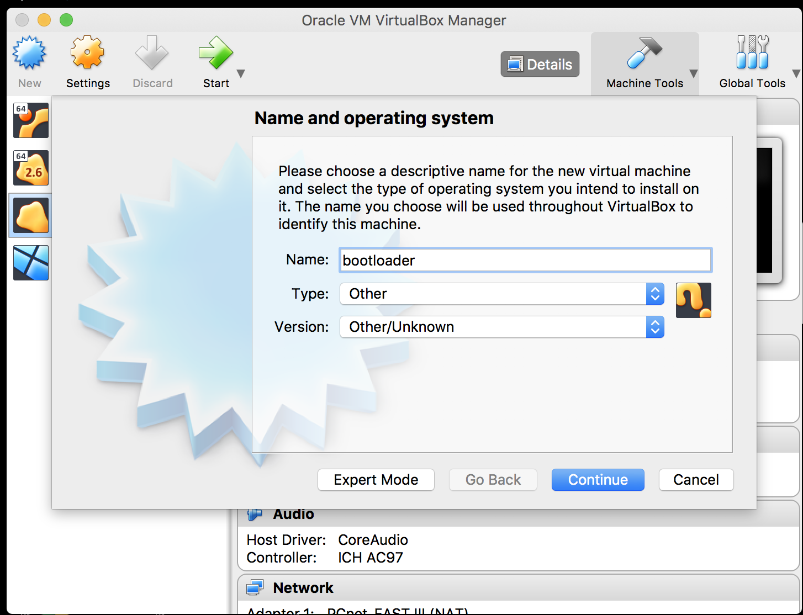
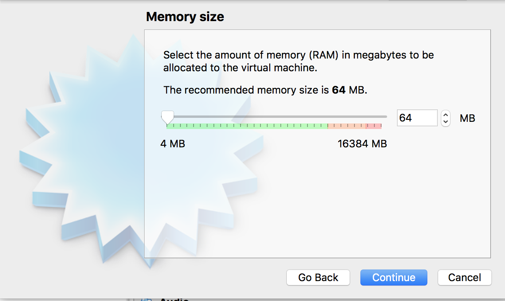
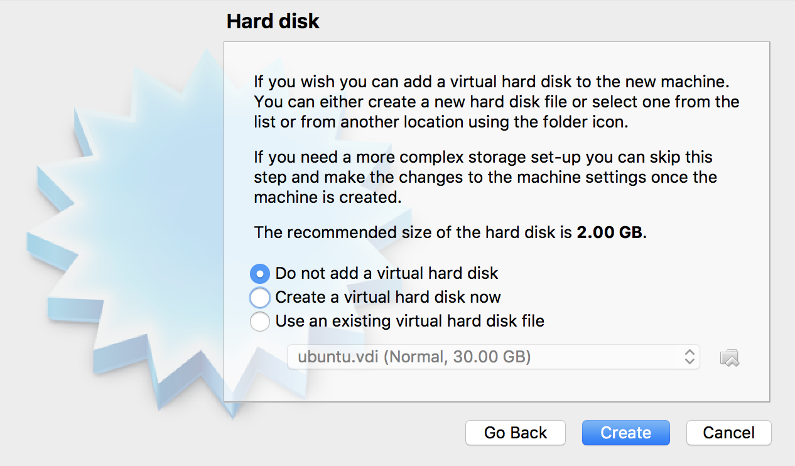
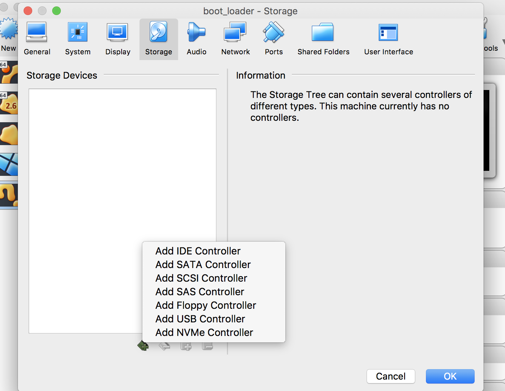
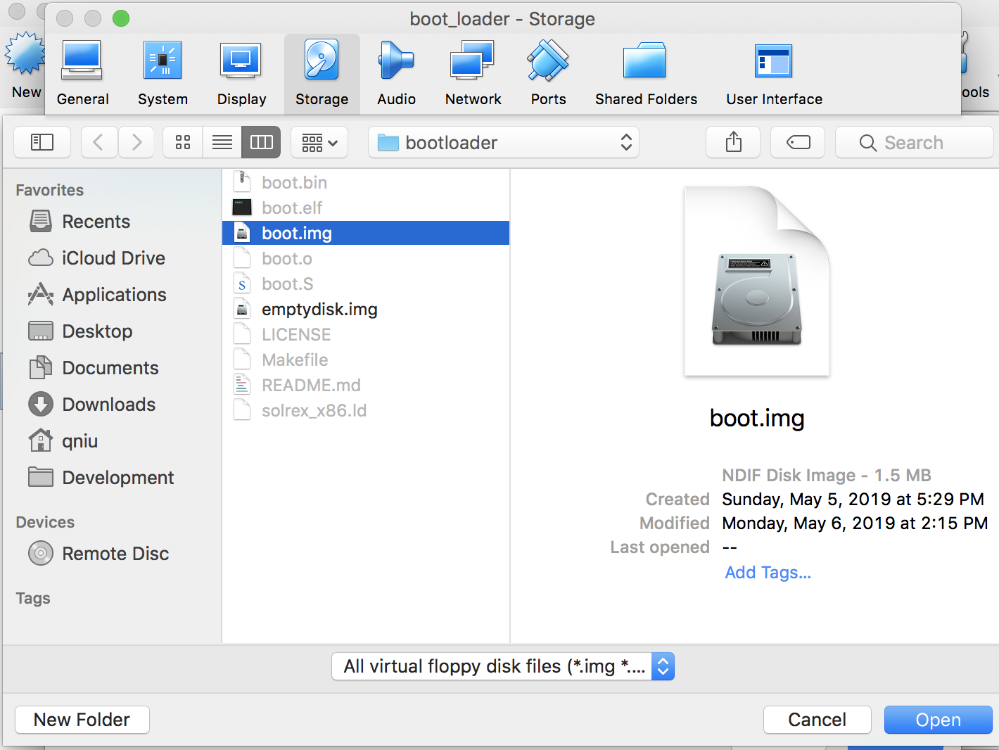
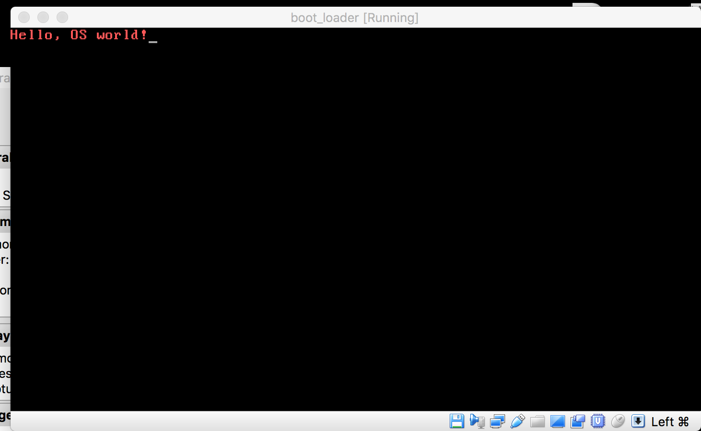

# bootloader

1. 配置编译环境
见[docker image: compile_env](https://github.com/linuxstudygroup/docker_images)

2. 在项目文件夹下进入编译环境

```bash
$ compile_env
```

3. 制作bootloader

```bash
#! in compile env
$ make
```

4. 使用virtualbox运行bootloader
    1. 新建虚拟机
    
    
    2. 设置内存大小
    

    3. 不要创建虚拟硬盘
    

    4. 在设置中给虚拟机添加软盘控制器（floppy controller）
    

    5. 选择软盘文件
    

    6. 启动虚拟机
     

